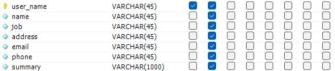
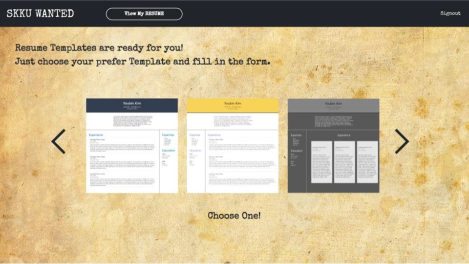

# SKKU-WANTED

## Introduction
We have created a page that can help in the process of writing RESUME, which is a concern of all job seekers.
It is a web page service that provides a resume template for free and completes the resume when a user signs up and logs in.
When user selects a preferred template and fills out an input form that fits the template format, it is automatically applied to the template and a completed resume is provided.  
Users can save the completed resume as an image file, and log in to the web page again later to check their saved resume.
The project is entitled <em>“SKKU WANTED”</em>. We've created a webpage with the intention of helping user become the "Wanted" person in the job market through a great resume.

## Programming Language and Development Environment
Frontend: HTML, CSS, JavaScript  
Backend: JSP(Java 19.0.1), MySQL 8.0.31  
Development Platform: Eclipse IDE 4.25.0, Tomcat v8.5 Server, MySQL Workbench  

## File description

(1) Login page (index page, page where login and signup are performed)  
index.html, login.css, login.js, login_validate.jsp, signup_validate.jsp

(2) Main page (page where user can choose a template for writing resume and check user’s own resume.)  
main.html, main.css, main.js

(3) Input page (information input form page that fits the template)  
input.html, input.css, input.js, resume_validate.jsp

(4) Templage page (each template page with information entered through input page)  
template_1.jsp, template_1.css, template_2.jsp, template_2.css, template_3.jsp, template_3.css, template_4.jsp, template_4.css, template_5.jsp, template_5.css, template_6.jsp, template.js, html2canvas.min.js

(5) SQL file  
DDL.sql

(6) images file  
template_1.jpg, template_2.jpg, template_3.jpg, template_4.jpg, template_5.jpg, template_6.jpg, uncle_sam.png, wallpaper.jpg

## User manual

First, create a database named "websitedb" and set the username and password to "root". Subsequently, the attached "DDL.sql" file creates the following table:  
[users]  
  
[personal]  
  
[skills]  
  
[experience]  
  
[education]  

After creating the database, run the index.html file through the server and you will see the login screen:  
  
To log in, you must create an ID and save information in the database. Click sign up and create an ID.  
  
If your ID and password do not match, a warning message will be displayed and you will not be able to log in. Enter the correct ID and proceed to the next step.  
  
If you have successfully logged in, you can see the following screen:  
You can choose your favorite template from the six registered resume templates.  
  
After you select the template, you must enter the information you want to create on your resume. Create personal information, skills, academic, experience items and click the enter button  
  
  
This is how you got your own resume! To save your resume to your local repository, press the "Save This RESUME" button at the top left of the page.  
  

There are three buttons on the navigation bar:  
(1) Click the "SKKU WANTED" button to return to the main page.  
(2) If you want to see your last resume, click the "View my RESUME" button in the upper left corner of the main page.  
(3) Press the "signout" button in the upper right corner to log out after you've done all the work.  
  

## Code Architecture

(1) Frontend part

[login.js]  
Login:  
Save the logged in user name in session storage.  
Signup:  
Check format of all inputs. All signup input values are accessed by the id tag of each input. The signup button is enabled only when all inputs are in the correct format. 
first name: start with capital letter, numbers and special characters not allowed, no blank allowed  
last name: start with capital letter, numbers and special characters not allowed, no blank allowed  
email: follow standard email format, no blank allowed  
password: 6 characters or more, all numbers and characters allowed, no blank allowed

[main.js]  
Shows several templates. User can check other templates by clicking the arrow. If user selects the template to use, move to the input page. If user clicks the signout button, move to the login page. If ‘View My RESUME’ button click, move to completed resume page.

[input.js]  
Check format of all inputs. All form input values are accessed by the id tag of each input.  
name: numbers not allowed, no blank allowed  
job: numbers not allowed, no blank allowed  
address: no blank allowed  
email: follow standard email format, no blank allowed  
phone: 010-000(0)-0000 format, no blank allowed  
summary: no blank allowed

[template.js]  
If ‘Save This RESUME’ button click, capture the resume part of the current page and save it as an image file(.jpg). If user clicks the signout button, move to the login page.

[html2canvas.min.js]  
For screenshots with JavaScript, use the source of html2canvas(https://html2canvas.hertzen.com/) which is licensed under the MIT License.

(2) Backend part  
[DDL.sql]  
sql file for database table creation. Create a database with the following ER diagrams:  
  
Each table is associated with the user_name of the users table as the foreign key. The users table stores personal information, including login information, and the personal, skills, experience, and education tables store information for writing resume.  
[signup_validate.jsp]  
Connect to the mysql database and store the information entered in each form in the database. The information you need to enter includes username, password, firstname, lastname, and email.  
  
[login_validate.jsp]  
Connect to mysql database to compare the username entered in the form with the username stored in the database. If it doesn't match, display an error message, and if it does, log in successfully and proceed to the main page for writing your resume.  
[resume_validate.jsp]  
This is the part that processes information input data for resume preparation. Connects to the mysql database and stores each information entered in the form in the database. For example, the information entered in the personal table is:  
  
[template_1 ~ 6.jsp]  
Connect to mysql database to get the information entered in each form. After retrieving all the information from each database table, enter each information according to the template format specified. The template format is written using html and css, and the information retrieved from the database is included in the contents of each tag.

